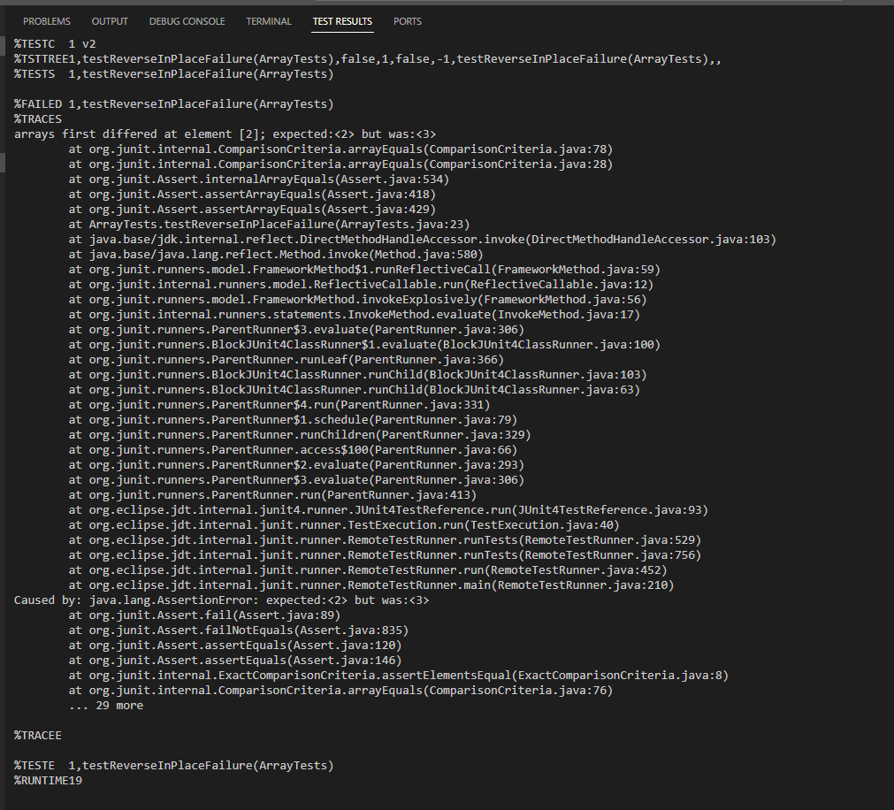
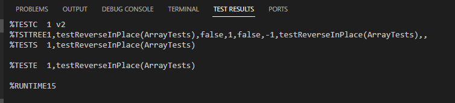

# Lab-Report-3---Bugs-and-Commands-Week-5-
## Part 1 - Bugs

### A failure-inducing input for the buggy program, as a JUnit test and any associated code
```
@Test
  public void testReverseInPlaceFailure() {
  int[] input = {1, 2, 3, 4};
  ArrayExamples.reverseInPlace(input);
  assertArrayEquals(new int[]{4, 3, 2, 1}, input);
}
```

### An input that doesn’t induce a failure, as a JUnit test and any associated code

```
@Test
public void testReverseInPlaceNoFailure() {
  int[] input = {1};
  ArrayExamples.reverseInPlace(input);
  assertArrayEquals(new int[]{1}, input);
}
```

### The symptom, as the output of running the tests
Output of Running the Failed Test:


Output of Running Passed Test:


### The bug, as the before-and-after code change required to fix it

```
// Changes the input array to be in reversed order
//Original Buggy Code
static void reverseInPlace(int[] arr) {
  for(int i = 0; i < arr.length; i++) {
    arr[i] = arr[arr.length - i - 1];
  }
}
```

```
// Changes the input array to be in reversed order
//Fixed Code
static void reverseInPlace(int[] arr) {
    int j = arr.length - 1;
    for(int i = 0; i < j; i++) {
      int temp = arr[i]; // Use 'temp' or another name that indicates a single value
      arr[i] = arr[j];
      arr[j] = temp;
      j--;
    }
  }
```
###  Briefly describe why the fix addresses the issue
The original buggy code does not appropriately reverse an array. For example, given a an array with size 4, [1,2,3,4], it reverses the first half without a problem, but when it tries to change the second half it will pull the numbers that already changed not the output we actually want. This results in the output 
> [4,3,3,4]

instead of

> [4,3,2,1]

The fixed code ensures that the second half of the code is taken care of properly. It changes the first and the last position of the array, the second in the list and the second to last in the list until it reaches the middle. We ensure the already flipped position doesn't get flipped again by 
> i < j

So, given [1,2,3,4,5]
> 1) [5,2,3,4,1] 1st flip (switches index 0 and index 4)
> 2) [5,4,3,2,1](switches index 1 and index 3)
> 3) No switch can't switch as we would do index 2 and 2 and anything else would do index
> j < i

## Part 2 - Researching Commands\
### 'Find' Command
**I searched "find command-line options" and found. I used the same source for all.**
**Source: https://man7.org/linux/man-pages/man1/find.1.html**

1) *-name: Allows you to find files in a directory by matching a inputed text pattern*
   Example 1:
   > find ./technical -name "*.txt"

   This will output all files with a .txt extension in the ./technical directory and it's subdirectories.

   Example 2:
   > find ./technical -name "config*"

   This will find all files that start with "config" in the techhnical directory; does not worry about the extension.
   
3) *-mtime: Allows you to find  files in a directory based on the last time they were modified*
   Example 1:
   > find ./technical -mtime -10

   This will find all files that have been modified in the last 10 days in the ./technical directory.

   Example 2:
   > find ./technical -mtime +30
   
   This will find all files that have been modified MORE THAN 30 days ago in the ./technical directory.
   
4) *-size: Allows you to find files in a directory based off size.*
   Example 1:
   > find ./technical -size -500k
   
   This will find files SMALLER than 500 kilobytes in the ./technical directory.

   Example 2:
   > find . -size +1G
   
   This will find files BIGGER than 1 gigabyte in the ./technical directory.

5) *-delete: Allows you to delete files or directories;.*
   Example 1:
   > find ./technical -name "*.txt" -delete

   This will delete all files with the .txt extension in the ./technical directory.

   Example 2: 
   > find ./technical -name "*.log" -mtime +7 -delete

   This will delete all files with the .log extension in the ./technical directory.
              


