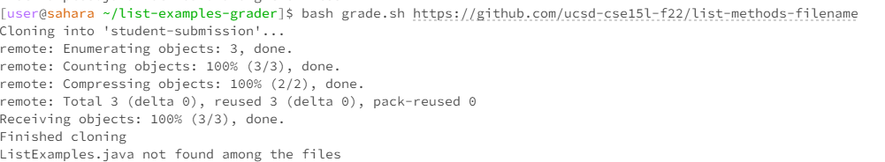
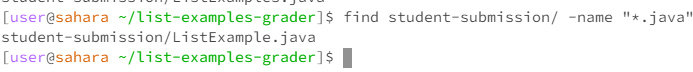

# Lab Report 5 - Putting it All Together (Week 9)

## Part 1 – Debugging Scenario

####  1) Original Post from Student
Title: Compiling Issue 

Hi all,

I am working on this weeks Programming Assignement for ListExamples.java, but it's failing to compile, I don't think the issue has to do with my actual code because I other TAs helped me with the code. Based off the message I think it has to do with the filepath or the directory but I am not sure.
Here's the screenshot of the terminal showing the compilation error:



#### 2) Response from a TA
   
Hello,

The error message suggests there might be an issue with how the script is locating or compiling the ListExamples.java file. To better understand what's happening, could you please run the following command in your student-submission directory and share the output? This will help us see the exact structure and location of the ListExamples.java file.

``` find student-submission/ -name "*.java" ```

This will find any java files in your directory, after finding this we can find out if you are providing the file in the correct format which seems to be the issue here. You should find "ListExamples.java".

#### 3) Student's response:
   
 I ran the find command in the student-submission directory, and here's the output:



   I realized my file was called ListExample.java, without the "s". Thank you for very much this worked.

#### The file & directory structure needed:
directory needed: student-submission/ListExamples.java
file needed: ListExamples.java
  
#### The contents of each file before fixing the bug:

# ListExample.java :

```
import java.util.ArrayList;
import java.util.List;

interface StringChecker { boolean checkString(String s); }

class ListExample {

  // Returns a new list that has all the elements of the input list for which
  // the StringChecker returns true, and not the elements that return false, in
  // the same order they appeared in the input list;
  static List<String> filter(List<String> list, StringChecker sc) {
    List<String> result = new ArrayList<>();
    for(String s: list) {
      if(sc.checkString(s)) {
        result.add(s);
      }
    }
    return result;
  }


  // Takes two sorted list of strings (so "a" appears before "b" and so on),
  // and return a new list that has all the strings in both list in sorted order.
  static List<String> merge(List<String> list1, List<String> list2) {
    List<String> result = new ArrayList<>();
    int index1 = 0, index2 = 0;
    while(index1 < list1.size() && index2 < list2.size()) {
      if(list1.get(index1).compareTo(list2.get(index2)) < 0) {
        result.add(list1.get(index1));
        index1 += 1;
      }
      else {
        result.add(list2.get(index2));
        index2 += 1;
      }
    }
    while(index1 < list1.size()) {
      result.add(list1.get(index1));
      index1 += 1;
    }
    while(index2 < list2.size()) {
      result.add(list2.get(index2));
      index2 += 1;
    }
    return result;
  }


}
```

# grade.sh

```
 CPATH='.:lib/hamcrest-core-1.3.jar:lib/junit-4.13.2.jar'
CPATHNEW='.:../lib/hamcrest-core-1.3.jar:../lib/junit-4.13.2.jar'

rm -rf student-submission
rm -rf grading-area

mkdir grading-area

echo ""

git clone $1 student-submission
echo 'Finished cloning'

echo ""

FILEPATH=`find student-submission/ -name ListExamples.java`


if [ ! -f "./student-submission/ListExamples.java" ]; then
    echo "ListExamples.java not in current directory."
    exit

else
    echo "ListExamples in current directory."
fi

echo ""

cp $FILEPATH grading-area
cp TestListExamples.java grading-area
echo 'Copy Complete'

echo ""

javac -cp $CPATH grading-area/*.java
cd grading-area
java -cp $CPATHNEW org.junit.runner.JUnitCore TestListExamples > testResults.txt
cd ..
echo 'Compile and ran'


numtest=`grep "@Test" grading-area/TestListExamples.java | wc -l`

if grep "OK" grading-area/testResults.txt; then
    echo "Score: " $numtest / $numtest
    exit
fi

result=`grep "Tests run: " grading-area/testResults.txt`

score=$(($numtest - ${result:(-2)}))
echo ""
echo "Score: " $score / $numtest
```

- The full command line (or lines) you ran to trigger the bug
  
```
FILEPATH=`find student-submission/ -name ListExamples.java`

if [ ! -f "./student-submission/ListExamples.java" ]; then
    echo "ListExamples.java not in current directory."
    exit

else
    echo "ListExamples in current directory."
fi
```

- A description of what to edit to fix the bug
  
  The file is completely correct code wise, but it is named ListExample.java not ListExamples.java, every single character is important for the autograder.

# Part 2: 
In the lab, I learned how to troubleshoot problems because I have never worked an environment where I am given instructions and have to complete a task without explicit direction. I liked it because it helped me realize where my strengths and weakness are when it comes to coding. I met a lot of people in lab that helped exercise my teamwork skills, which is important as computer science is heavy on collaboration in the work field. I learned how to utilize my resources, mainly the Internet, when I don't know what to do next given an instruction, whether that be asking A.I. are going on Stack Overflow for advice. My favorite part of the second half of the class was learning how to create an autograder. It is fascinating to create one because of how often we as CSE students use autograders, it is important we know how to read them and know how they work. 


